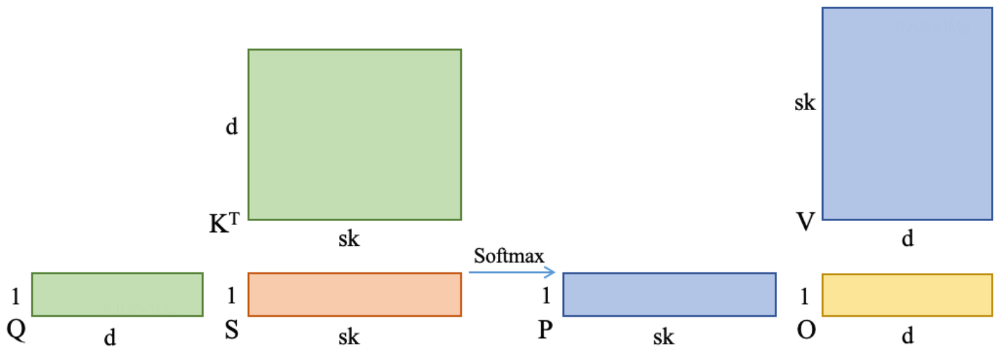
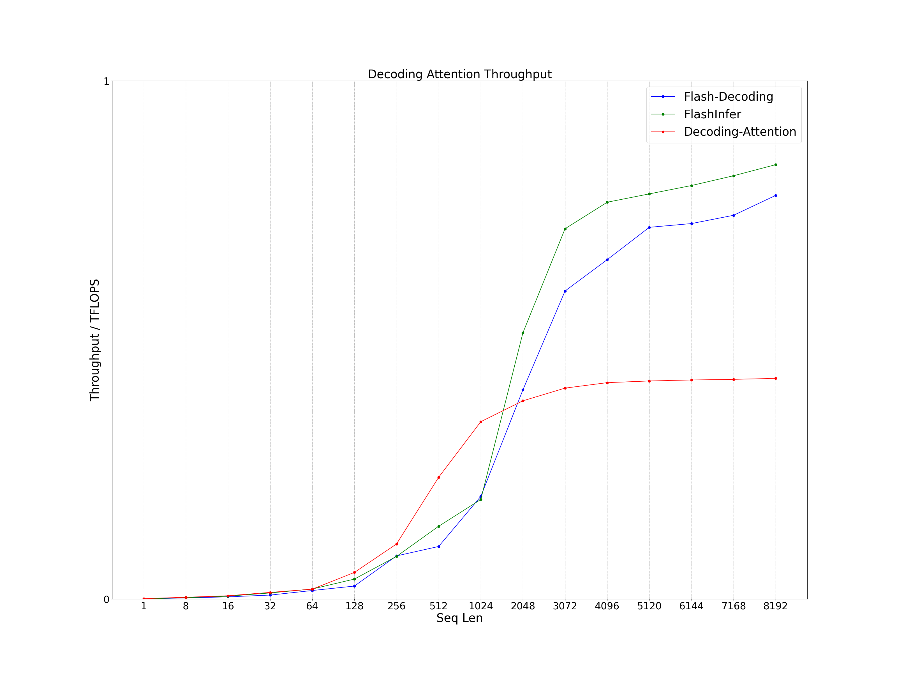
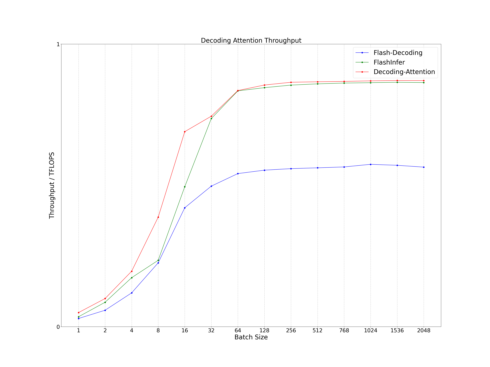

# Decoding Attention
Decoding Attention is specially optimized for multi head attention (MHA) using CUDA core for the decoding stage of LLM inference. It mainly refers to OpenPPL and Flash Attention, which can solve the problem of low tensor core utilization of Flash Attention in the decoding stage of LLM inference and support more types of attention and kv cache quantization optimization. The calculation expression is as follows, where the precision of tensor Q, K, V and O is FP16 or BF16. In some LLM inference decoding scenarios, the performance of Decoding Attention is better than Flash Decoding (Flash Attention) and FlashInfer. In addition, Decoding Attention also supports variable length, GQA / MQA and ALiBi inference scenarios.
```
O = Softmax(Q * K^T) * V
```



# Support
- Variable Length: Variable kv length inference
- GQA / MQA: Group query attention / multi query attention inference
- ALiBi: Attention with linear biases inference

# Environment
- OS: Linux
- Cmake Version: >= 3.16
- GCC Version: >= 5.0
- CUDA Version: >= 11.4
- Others: gflags, ccache, pytest
```
sudo apt-get install libgflags-dev ccache
pip install pytest
```

# Clone
```
git clone https://github.com/Bruce-Lee-LY/decoding_attention.git
```

# CPP API
## Build
### NVIDIA A100
```
cd decoding_attention
./build_cpp.sh -a 80 -t Release -b OFF
./build_cpp.sh -a 80 -t Debug -b OFF
```

### RTX3080Ti / RTX3090 / RTX A6000
```
cd decoding_attention
./build_cpp.sh -a 86 -t Release -b OFF
./build_cpp.sh -a 86 -t Debug -b OFF
```

## Test
```
./run_cpp.sh
```

## Benchmark
```
./run_cpp.sh
```

## Performance
Process the cpp result in the log and plot it as a line chart.

```
cd tools/performance/cpp
./performance.sh
```

# Python API
## Install
```
cd decoding_attention
./install_python.sh
```

## Test
```
./run_python.sh
```

## Benchmark
```
./run_python.sh
```

## Performance
Process the python result in the log and plot it as a line chart.

```
cd tools/performance/python
./performance.sh
```

### RTX3090
- CUDA Version: 12.1
- Head Num: 32
- Head Dim: 128
- Data Type: FP16

#### Seq Len
The performance of Decoding Attention is better when the sequence length is below 1536, while the performance of Flash Decoding (Flash Attention) and FlashInfer is better when the sequence length is above 1536.
- Batch Size: 1
- Seq Q: 1
- Seq K: Seq Len



#### Batch Size
Regardless of bacth size, Decoding Attention has better performance than Flash Decoding (Flash Attention) and FlashInfer.
- Batch Size: Batch Size
- Seq Q: 1
- Seq K: 128



# Reference
- [ppl.llm.kernel.cuda](https://github.com/OpenPPL/ppl.llm.kernel.cuda)
- [flash-attention](https://github.com/Dao-AILab/flash-attention): v2.6.3
- [flashinfer](https://github.com/Bruce-Lee-LY/flashinfer): v0.1.6

# TODO
- Kernel Optimization
- KV Cache Quantization: FP8、Int8、Int4
